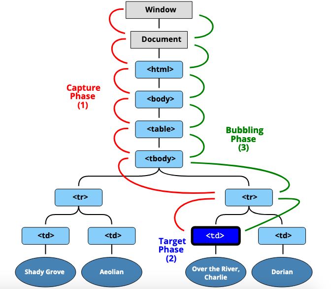

<a name="events"></a>
# **Module #5 - Events**
---
<a name="eventListener"></a> 
## **Event listener**

things on the DOM can emit events, when they're clicked, hovered, dragged, etc.
We can use event listener to listen for when these events happen and do something, react to them.
You can attach event listeners to all elements, also the window and the document.

as an example, lets attach an event listener to a bottom.

```html
<body>
  <button class="butts">Click Me!</button>
</body>
```
javascript
```js
// select elements
const butts = document.querySelector('.butts');

// add the event listener
butts.addEventListener('click', function(){
  console.log('it got clicked!');
  });
```

```addEventListener``` will take usually two arguments, the first one is the type of event that you want to listen to (in this case is _click_), and the second one is a callback function

>**NOTE:** callback function is a regular function that will be called in a later point and the browser will call that function for us when it needs to.

we can also create a named function outside and passed in as a reference:

```js
// select elements
const butts = document.querySelector('.butts');

// function (same function converted in an arrow function)
function handleClick = () => console.log('it got clicked!');

// add the event listener
butts.addEventListener('click', handleClick);
```
the benefits of making an outside function is that you can use the same function on different buttos or any other event listener, the second benefit is that if you want to remove an event lister it will be reference to a function in the second argument:

```js
butts.removeEventListener('click', handleClick);
```

We can also select multiple items, lets se that with an example:

```HTML
<button class="buy">Buy Item 1</button>
<button class="buy">Buy Item 2</button>
<button class="buy">Buy Item 3</button>
<button class="buy">Buy Item 4</button>
<button class="buy">Buy Item 5</button>
```
suppose that we have to attach an event listener for a click on each button
  - first we need to select the items
  - if we look into the prototype there is a method called ```forEach``` that we will need to use in order to attach an event listener for avery element

```js
//listen on multiple items
const buyButtons = document.querySelectorAll('.buy');

// function to buy items on the page
function buyItem(){
  console.log('Buying items');
}

//loop into the elements (attach event listener for each element)
buyButtons.forEach(function(buyButton){
  buyButton.addEvenetListener('click', buyItem);
});
```

>**Note:** the parameter in the ```forEach``` method can be called whatever you want, is like a placeholder, in this case it was called buyButton in singular

we can also create a function outside and pass it to the forEach method

```js
// function to attach event listener
function attachListenerToButtons(buyButton){
  buyButton.addEventListener('click', buyItem);
}

// loop into each element
buyButtons.forEach(attachListenerToButtons);
```
>You can find the example [here](https://codepen.io/cgope/pen/QWKLXWK)

<br>

<a name="TargetsBubblingPropagationCapture"></a> 
## **Targets, bubbling, propagation and capture**
Continue with the last example "buy buttons"

```js
const buyButtons = document.querySelectorAll('button.buy');

function handleBuyButtonClick(){
  console.log('you are buying');
}

buyButtons.forEach(function(buyButton){
  buyButton.addEventListener('click, handleBuyButtonClick);
});
```

The ```handleBuyButtonClick``` function is handle the cliking for buttons, so how do i know which specific button they have clicked?
That information is hidden away in the **event object**
The event object is an is object that is filled with all kind of information of user useful information and methods to work with the event.

In order to access the event object, we modify our callback to accept a param that is the **event**

```js
function handleBuyButtonClick(event){
  console.log('you are buying');
}
```

>**Note:** Parameters are placeholders so when we difine a function we can put a parameter and call it event, and it doesnt matter how we called as long as is the first argument of our callback.<br> You can [click here](https://developer.mozilla.org/en-US/docs/Web/API/EventTarget/addEventListener#The_event_listener_callback) for more information.

Now we can console log the event ```console.log(event)``` and we will see the pointer event, the pointer event is the consolidated of all the events we have like clicks, touches and all these mouse events.
We will use target and current target for the next examples.
Lets add a price to the buttons:

```HTML
<button data-price-"100" class="buy">Buy Item 1</button>
<button data-price-"200" class="buy">Buy Item 2</button>
<button data-price-"300" class="buy">Buy Item 3</button>
<button data-price-"400" class="buy">Buy Item 4</button>
<button data-price-"500" class="buy">Buy Item 5</button>
```
Now using the taget we should be able to access the price of each button, but these price is a string so we will parse as number (float):


```js
const buyButtons = document.querySelectorAll('button.buy');

function handleBuyButtonClick(event){
  console.log('you are buying');
  console.log(parseFloat(event.target.dataset.price));
}

buyButtons.forEach(function(buyButton){
  buyButton.addEventListener('click', handleBuyButtonClick);
});
```

> You can find the example [here](https://codepen.io/cgope/pen/wvzMdaJ?editors=0010)

The difference between ```target``` and ```currentTarget```?
The difference comes in when you have elements that are nested inside of the element that you are listening to, for example lets wrap the number of the buy button inside a strong tag

```HTML
<button data-price-"100" class="buy">Buy Item <strong>1</strong></button>
<button data-price-"200" class="buy">Buy Item <strong>2</strong></button>
<button data-price-"300" class="buy">Buy Item <strong>3</strong></button>
<button data-price-"400" class="buy">Buy Item <strong>4</strong></button>
<button data-price-"500" class="buy">Buy Item <strong>5</strong></button>
```

so if you click in the number inside the button you will notice that ```event.target``` is the thing that actually got clicked (the number) and the ```event.currentTarget``` is the thing that fired the event listener

Is possible to be clicking on multiple things at certain time, at that is **_propagation_** meaning that if we click in the strong tag, we also click the button, and we also click in the body, and also clicked the html, window, etc ...
The way that you can prevent that is with a method on the event that's called stop propagation

```js
// stop this event from bubbling up
event.stopPropagation()
```

The events can be the oposite, that is called **_Capture_** which is the opositive to propagation
the following image should explain this:



> you can click [here](https://developer.mozilla.org/en-US/docs/Web/API/EventTarget/addEventListener) for more information about bubbling and capture

<br>

<a name="PreventDefaultAndFormEvents"></a> 
## **Prevent default and form events**

There's a couple elements in HTML that have default functionality when they're clicked, for example a submit button, and we can stop the default action by using: 

```js
event.preventDefault()
```

For example we want to prevent the submit default if the name of a input form is "chad"

```HTML
<div class="wrapper">
  <form name="singup">
    <label for="name">Name</label>
    <input type="text" id="name" name="name">
    <label for="email">Email</label>
    <input type="email" id="email" name="email">
    <input type="checkbox" id="agree" name="agree">
    <label for="agree"> I agree to the terms and conditions</label>
    <hr>
    <button type="submit">Submit</button>
  </form>
</div>
```
so our javascript should be something like:

```js
const signupForm = document.querySelector('[name="singup"]');

signupForm.addEventListener('submit', function(event){
  const name = event.currentTarget.name.value;
  if(name.includes('chad')){
    alert('sorry bro')
    event.preventDefault();
  }
});
```

The ```preventDefault()``` will help us to stop the default action, so if the name is chad it will not sent the information when you click submit, if you remove the ```preventDefault()```, it will send the information after the validation.

> you can see the example [here](https://codepen.io/cgope/pen/eYdJWeb?editors=0010)

<br>

<a name="AccesibilityGotchasAndKeyboardCodes"></a> 
## **Accesibility gotchas and keyboard codes**

The differences between buttons and links:
Buttons are to be used for actions tha happend inside the application.  
Links are used to change the page.  
that means that links are not to be used where buttons are.

Every key has a code, and the event have a bounch of information theres a Wes Bos website called [keycode.info](https://www.keycode.info) where you can literally just press on any key to get meta information about that key.


<br>

---
back to [Table of Content](tableOfContent.md)  
previous [The DOM](04_dom.md)  
next []()