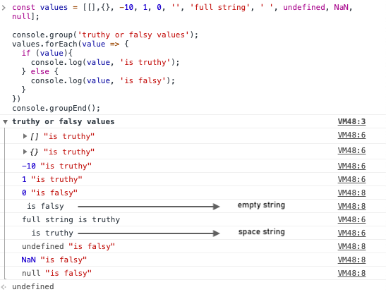
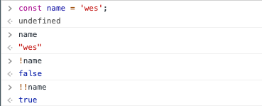

<a name="LogicAndFlowControl"></a>

# **Module #7 - Logic and flow control**

---

<a name="bedmas"></a>

## **BEDMAS**

BEDMAS refers to the order of operations, is the same as Maths do it:

**B** = brackets - **E** = exponents - **D** = division - **M** = multiplication - **A** = addition - **S** = subtraction

So the order means that things inside the brackets or parentheses go first, then we do exponents (which is sort of like the power of).  
Then division, multiplication, addition and subtraction.

This is like exponents looks like in javascript:

```js
2 ** 2; // result is 4
2 ** 10; // result 1024
```

Back to order of operation:

**Example:** First multiplication then subtraction.

```js
const example = 10 * 5 - 2;
//result should be 48
```

**Example 2:** First the subtraction due to the parentheses, then the multiplication.

```js
const example1 = 10 * (5 - 2);
//result should be 30
```

<br>

<a name="flowControlIfFunctionReturnsTruthyFalsy"></a>

## **FLOW CONTROL - IF STATEMENTS, FUNCTION, RETURNS, TRUTHY, FALSY**

<br>

<a name="statement"></a>

- ### **Statements**

  Statements are the foundation of all logic in javascript, they expect boolean which is a type in Javascript that is always either true or false.  
  To explain the mechanics of an if statement we will use the greater or less than operators:

  we want to evaluate a condition that will be true or false

  ```js
  if (10 > 2) {
    console.log("yes, 10 is greater than 2");
  }
  ```

  the condition is `(10 > 2)` if that is true then what ever things that needs to happen should be inside the block which is delimitated by the curly brackets that are opening and closing the block.  
  We can have multiple conditions by using `else if`

  ```js
  if (10 > 2) {
    console.log("yes, 10 is greater than 2");
  } else if (11 > 10) {
    console.log("yes, 11 is greater than 10");
  } else if (3 > 1) {
    console.log("yes, 3 is greater than 1");
  }
  ```

  But if the first one is true, even id ones that come later are also true they will never run, that means that we only get the first one (`yes, 10 s greater than 2`)

  If you want to check for multiple things that are true or false you will need three separate statements

  ```js
  if (10 > 2) {
    console.log("yes, 10 is greater than 2");
  }

  if (11 > 10) {
    console.log("yes, 11 is greater than 10");
  }

  if (3 > 1) {
    console.log("yes, 3 is greater than 1");
  }
  ```

  Additionally if nothing match you can put an `else` to the end, and the else does not need a condition

  ```js
  const age = 50;

  if (age > 70) {
    console.log("in your seventies");
  } else if (age > 60) {
    console.log("in your sixties");
  } else if (age > 50) {
    console.log("in your 50s");
  } else {
    console.log("nothing was true");
  }
  ```

<br>

<a name="ifStatement"></a>

- ### **If statements inside a function**

  And statement into a function can return different values, we have a function called slugify, and what this function does is take a sentence and a boolean of whether we should lowercase or not, then we return the sentence calling a replace method and using a _Regex_ (regular expression) we will replace the spaces for dashes.  
  In this case Regex looks like this

  ```js
  /\s/g, "-";
  ```

  Regex always start with an `/` and it closes with another slash `/`  
  The `\s` is referring to and space
  The `g` is referring to a global, so find them all, not just the first space.  
  Finally every space will be replaced by a dash.
  So this is the function:

  ```js
  function slugify(sentence, lowercase) {
    if (lowercase) {
      return sentence.replace(/\s/g, "-").toLowerCase();
    } else {
      return sentence.replace(/\s/g, "-");
    }
  }
  ```

  some developers prefers to keep as much logic out of the brackets, to prevent delete something, so lets remake the function

  ```js
  function slugify(sentence, lowercase) {
    let slug = sentence.replace(/\s/g, "-");

    if (lowercase) {
      return slug.toLowerCase();
    }
    return slug;
  }
  ```

  The first thing is removing the else, since we are using the return is not necessary the else

  > the return means to return a value from a function and stop that function from running.

  Then we can create a variable for the replace.

  Another way we can use statements in functions is for example if we have a function that checks if a name is inside a word like the word _awesome_

  ```js
  function nameIsAwesome(name) {
    return "awesome".includes(name);
  }
  ```

  Then we can check with and if statement if that condition is true or false

  ```js
  if (nameIsAwesome('wes'){
    console.log('Cool name');
  }
  ```

<br>

<a name="operators"></a>

- ### **Operators**

  In [previous module](01_basics.md#booleans) we learn about equals, double equals and triple equals, now we can use _not equal_ operator by using a bang followed by double equals `!==` and that means not equal, other operators and examples:

  - `!==` means not equal
  - `>` means greater than `10 > 2`
  - `>=` means greater or equal to `10 >= 10`
  - `<` means less than `10 < 11`
  - `<=` means less or equal to `10 < 10`
  - `||` means or operator
  - `&&` means and operator

  > greater and less operator only works with numbers

  Lets see how `||` and `&&` works with and example:

  - OR example: we want to check if someone name is equal to Wes or Scott

    ```js
    const name = "wes";

    if (name === "wes" || name === "scott") {
      console.log("cool name");
    }
    ```

  - AND example: we want to check if the first name and last name are the same

    ```js
    const name = "wes";
    const last = "bos";

    if (name === "wes" && last === "bos") {
      console.log("cool name");
    }
    ```

  - BEDMAS example: we can combine OR and AND together and check if the name is equal to Scott **OR** the name is equal to Wes **AND** last name is equal to bos

    ```js
    const name = "wes";
    const last = "bos";

    if (name === "scott" || (name === "wes" && last === "bos")) {
      console.log("cool name");
    }
    ```

    in order to this can work the whole **AND** condition ned to be true

<br>

<a name="truthyFalsy"></a>

- ### **Truthy Falsy**

  There are values that are truthy and false, lets see that:

  | Truthy values |        Falsy values         |
  | :-----------: | :-------------------------: |
  |       1       |              0              |
  |      -10      |     undefined variable      |
  |  full string  |    variable set as null     |
  | string of "0" | variable `"hello" -10 (NaN) |
  |  empty array  |        empty string         |
  | empty object  |                             |
  |               |                             |

  You can check by copy and past this code in your console browser:

  ```js
  const values = [
    [],
    {},
    -10,
    1,
    0,
    "",
    "full string",
    " ",
    undefined,
    NaN,
    null,
  ];

  console.group("truthy or falsy values");
  values.forEach((value) => {
    if (value) {
      console.log(value, "is truthy");
    } else {
      console.log(value, "is falsy");
    }
  });
  console.groupEnd();
  ```

  This is the output:

  

  This is how it looks like in an example:
  Lets use an string and an empty string, an empty string is falsy and a string is truthy.
  So we have an if statement that will compare a variable called dog, if the variable is truthy it will tell us _you have a dog_ but if the variable is falsy it will tell us _you don't have a dog_

  ```js
  const dog = '';

  if (dog){
    console.log('you have a dog');
  } else {
    console.log('you don't have a dog');
  }
  ```

  If you run this with an empty string like in the example, the return will be _you don't have a dog_ since an empty string has a value of falsy, but if you assign a value to the variable dog, you will get _you have a dog_ since a string has a truthy value

<br>

<a name="coercionTernariesAndConditionAbuse"></a>

## **COERCION, TERNARIES AND CONDITIONAL ABUSE**

<a name="coercion"></a>

- ### **Coercion**

  Coercion is when we force a different type, like string, number or an object, etc, into a real boolean.
  As an example, if we have a variable called name and we assign a string value to that variable we can coercing into true or false using the bang operator.  
  Then we can check if the variable has a value or not  
  

<a name="ternaries"></a>

- ### **Ternaries**

  Is something like a shorthand if statement, used to quickly assign or run functionality based on something being true or false.  
  Ternaries needs 3 things:

  - condition
  - what to do if it's true
  - what to do if it's false

  As an example:
  we want to know how many items you have in a cart

  ```js
  const count = 2;
  let word;

  if (count === 1) {
    word = "item";
  } else {
    word = "items";
  }

  const sentence = `you have ${count} ${word} in your cart`;
  console.log(sentence);
  ```

  If the number is equal to 1 the word will be item, otherwise the word will be items.

  Now we have the 3 conditions to make it as a ternary, and will look like this:

  ```js
  const count = 2;

  const word = count === 1 ? "item" : "items";

  const sentence = `you have ${count} ${word} in your cart`;
  console.log(sentence);
  ```

  so we have:

  - the condition (`count === 1`)
  - what to do if its true (`? 'item'`)
  - what to do if its false (`: 'items'`)

  We can use the ternary directly into the variable sentence:

  ```js
  const count = 2;

  const sentence = `you have ${count} item ${
    count === 1 ? "" : "s"
  } in your cart`;

  console.log(sentence);
  ```

  We can also use ternaries for running functions:  
  In this case if the variable isAdmin is true will run the function if not it will do nothing, and to do nothing the word _null_ should be there (is the false case)

  ```js
  function showAdminBar() {
    console.log("showing admin bar");
  }

  const isAdmin = true;

  isAdmin ? showAdminBar() : null;
  ```

  <br>

<a name="conditionalAbuse"></a>

- ### **Conditional abuse**

  This is related with the _AND AND TRICK_

  ```js
  function check1() {
    console.log("running check 1");
    return true;
  }
  function check2() {
    console.log("running check 2");
    return true;
  }
  function check3() {
    console.log("running check 3");
    return true;
  }
  ```

  If we want to make sure that all this functions are true we can run an if statement like this:

  ```js
  if (check1() && check2() && check3()) {
    console.log("all checks passed");
  } else {
    console.log("some check failed");
  }
  ```

  If one of those is false, the next one will never run.

  writing the _isAdmin_ example with the AND AND TRICK, it looks like that:

  ```js
  function showAdminBar() {
    console.log("showing admin bar");
  }

  const isAdmin = true;

  isAdmin && showAdminBar();
  ```

  The way that works can be consider abuse, the last part of code is validating:

  - if isAdmin is true then it will run the function.
  - if isAdmin is false it will stop, since the && only works if all is true.

<br>

<a name="blockless"></a>

- ### **Blockless if statements**

  This means that if something is on the same line, you dont need the block of the statements:

  ```js
  if (isAdmin) {
    showAdminBar();
  }
  ```

  this can be blockless like this:

  ```js
  if (isAdmin) showAdminBAr();
  ```

<br>

<a name="switchTurtleWithCSS"></a>

## **CASE SWITCH AND ANIMATING A TURTLE WITH CSS VARIABLES**

Switch should be used when you have a whole bunch of different cases and each have to be clearly defined, we are not comparing values, what we want is to do different things according of what key was typed.

the syntax of a switch statement looks like this:

```js
switch (expression) {
  case 1:
    // code block
    break;
  case 2:
    // code block
    break;
  case 3:
    // code block
    break;
  default:
  // code block
}
```

it always need a break and the end of each case, if you don't break then it will keep going down of each cases.  
If theres no match the default code will be executed.

To apply this concepts we are going to make a cool example of an a turtle that will walk through the screen

> Example [here](https://codepen.io/cgope/pen/BaQEexo)

First thing is select elements:

```js
const turtle = document.querySelector(".turt");
```

we will need to listen for a key down and then run a function to handle the movement, we only care for the arrow keys (up, down, left, right).

```js
window.addEventListener("keydown", handleKeyDown);
```

Now the function:

```js
function handleKeyDown(event) {
  //if is not an arrow key, we don't care
  if (!event.key.includes("Arrow")) {
    return;
  }
  //switch
  switch (event.key) {
    case "ArrowUp":
      y = y - 1;
      rotate = -90;
      break;
    case "ArrowDown":
      y = y + 1;
      rotate = 90;
      break;
    case "ArrowRight":
      x = x + 1;
      flipped = false;
      rotate = 0;
      break;
    case "ArrowLeft":
      x = x - 1;
      flipped = true;
      rotate = 0;
      break;
    default:
      alert("this is not a valid move");
      break;
  }
  turtle.setAttribute(
    "style",
    `
  --x: ${x * speed}px;
  --y: ${y * speed}px;
  --rotate: ${rotate}deg;
  --rotateX: ${flipped ? "180deg" : "0"};
  `
  );
}
```

the first part of the function will help to notice that if is not a arrow key, will do nothing

```js
//if is not an arrow key, we don't care
if (!event.key.includes("Arrow")) {
  return;
}
```

otherwise we will go into a switch statement, and for that we need to create some variables for the movements

```js
//variables for turtle moves
let x = 0;
let y = 0;
const speed = 10;
let flipped = false;
let rotate = 0;
```

- so the x will be right or left.
- the y will be up and down.
- speed is to move a little faster
- flipped means if goes to the left the img will flip (the head of the turtle will be pointed into the right direction)
- rotate means that if turtle goes up or down the head will point into the right direction

We create some CSS variables that then will be updated via Javascript.
The way that we can update the CSS variables is by using the `setAttribute` because there are not standard properties.

```js
turtle.setAttribute(
  "style",
  `
  --x: ${x * speed}px;
  --y: ${y * speed}px;
  --rotate: ${rotate}deg;
  --rotateX: ${flipped ? "180deg" : "0"};
  `
);
```

If you want to update standard CSS properties you can do like:

```js
turtle.style["background"] = red;
```

Now lets explain the switch:

```js
    case 'ArrowRight':
      x = x + 1;
      flipped = false;
      rotate = 0;
      break;
```

If an arrow right key was typed then we have to add 1 to the x in order to move the turtle to the right, then it will not flipped because the head is pointed to the right, the rotate will be 0.  
If an arrow up was typed then we need to subtract 1 to the y, we don't need to flip the turtle, but we need to rotate the turtle to -90deg in order to point the head of the turtle up

```js
  case 'ArrowUp':
      y = y - 1;
      rotate = -90;
      break;
```

<br>

<a name="intervalsTimers"></a>

## **INTERVALS AND TIMERS**

<a name="timeout"></a>

- ### **Timeout:**

  If you want to run something after sometime (i.e. after five seconds).

  `setTimeout();` is a method globally scoped that takes 2 arguments  
  The first one is the callback or an anonymous function and the second thing is the numbers of milliseconds to run after:

  ```js
  //with an anonymous function
  setTimeOut(function () {
    console.log("Done!");
  }, 500);

  //with a function outside
  function buzzer() {
    console.log("ENNGGGGGG");
  }

  setTimeout(buzzer, 500);
  ```

  An important thing to remember is the asynchronous nature of Javascript, that means that if you have:

  ```js
  console.log("starting");
  setTimeout(buzzer, 500);
  console.log("finishing");
  ```

  the output will show:

  - starting
  - finishing
  - ENNGGGGGG

  Thats because javascript will execute the first line _(starting)_ then go to the setTimeout and skipped because that one should be executed after 500 milliseconds, then go into the second console log _(finishing)_, and finally comeback to the setTimeout after 500 milliseconds.

  > callback is something that we call it at a later point in time

<br>

<a name="intervals"></a>

- ### **Intervals:**

  If you want to run something every so often. (i.e. every five seconds)

  `setInterval();` works in the same way that the timeout.  
  The first one is the callback or an anonymous function and the second thing is the numbers of milliseconds to run after:

  ```js
  function buzzer() {
    console.log("ENNGGGGGG");
  }

  setInterval(buzzer, 500);
  ```

  The only thing that you have to remember is that intervals doesn't run immediately, it runs after the time that you setup.

  If you want to run an interval immediately we need to code our own interval:

  ```js
  function buzzer() {
    console.log("ENNGGGGGG");
  }

  function setImmediateInterval(funcToRun, ms) {
    //right away call that function
    funcToRun();
    // run a regular interval
    return setInterval(funcToRun, ms);
  }

  setImmediateInterval(buzzer, 2000);
  ```

  This example will be executed immediately and then every 2000 milliseconds.  
  The `funcToRun()` works like an argument for the `setImmediateInterval()` function, and this argument will be executed when we pass an other function which is `buzzer()` so it will be executed immediately and then every 2 seconds.

<a name="clearTimersAndIntervals"></a>

- ### **Clear timers and intervals:**

  The way that you can clear timers and intervals is by reference into a variable, that later you can use.

  we have a page with a button, if you click the button before 5 seconds you will save the page, if not the page will be destroyed.

  > You can see the example [here](https://codepen.io/cgope/pen/WNoqqBZ)

  first thing create the HTML:

  ```HTML
  <div class="wrapper">
    <h1>Please click the button before 5 seconds to save the page</h1>
    <button class="save">Save</button>
  </div>
  ```

  Now variable for the timer and selecting elements:

  ```js
  //save timer into a variable
  const bombTimer = setTimeout(destroy, 5000);

  //select button save
  const save = document.querySelector(".save");
  ```

  then we create the function destroy:

  ```js
  //function destroy
  function destroy() {
    document.body.innerHTML = `
    <h1 align='center'>DESTROYED</h1>
    `;
  }
  ```

  and finally the event listener:

  ```js
  //add event lister to the button
  save.addEventListener("click", function () {
    alert("You save the page");
    clearTimeout(bombTimer);
  });
  ```

  <br>

---

back to [Table of Content](tableOfContent.md)  
previous [Serious practice exercises](06_SeriousPractice.md)  
next
