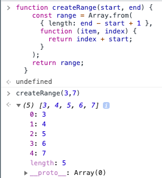
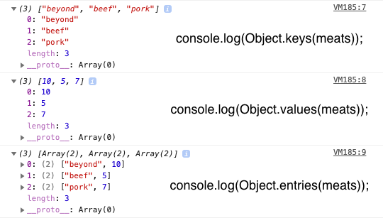

<a name="DataTypes"></a>

# **Module #8 - Data types**

---

<a name="objects"></a>

## **OBJECTS**

Objects allow us to group together properties and values (or key and values), they have many uses from storing related data, storing functionality, and creating custom types.
Is important to note that in objects the order of properties doesn't matter.

<a name="createObject"></a>

- ### **Create Object**

  Syntax:

  ```js
  const person = {
    name: "Cesar",
    age: "100",
  };
  ```

  > Note: properties in the left, values at the right

  We can use variables into an object:

  ```js
  const age = 100;
  const person = {
    name: "Cesar",
    age: "age",
  };
  ```

  In this case since the variable name is equals to the property name we can do:

  ```js
  const age = 100;

  const person = {
    name: "Cesar",
    age,
  };
  ```

  you can also have nested properties or objects to an object:

  ```js
  const age = 100;
  const person = {
    name: "Cesar",
    age,
    clothing: {
      shirts: 1,
      pants: 1,
    },
  };
  ```

<a name="add/modObject"></a>

- ### **Adding/modify a property**

  Adding a property after the object has been created is possible, same syntax if you want to over-write a property:

  ```js
  // add new property
  person.job = "Web Developer";

  //over-write a property
  person.age = 50;
  ```

  <br>

<a name="frozenObject"></a>

- ### **Frozen Object**

  You can modify any property of the object, but if you want to create an object that can't be modified any of their properties you can use **frozen object**:

  ```js
  const personFroze = object.freeze(person);
  ```

  this will create a frozen object from the object called person, this will not freeze the original person object, it will return a new freeze object, and you can't modify any of the properties, on this new object.

  <br>

<a name="accessObject"></a>

- ### **Access into a property of an Object**

  You can access to the objects properties from 2 different ways:

  - dot notation

    ```js
    //access
    person.name;

    //one level depp access
    person.clothing.shirts;
    ```

  - square brackets notation

    ```js
    //access
    person["name"];

    //one level depp access
    person["clothing"]["shirts"];
    ```

    > Example [here](https://codepen.io/cgope/pen/MWJwxxw)

  <br>

<a name="deleteObject"></a>

- ### **Delete Object properties**

  To delete a property of an object you can use the `delete` key word

  ```js
  delete person.job;
  ```

<br>

<a name="functionObject"></a>

- ### **Functions inside Object**

  We can have functions inside an objects, that what is call **Method**

  ```js
  const person = {
    name: "Cesar",
    sayHello: function (greeting = "Hey") {
      return `${greeting} ${this.name}`;
    },
  };
  ```

  There's also a method shorthand:

  ```js
  const person = {
    name: "Cesar",
    sayHello(greeting = "Hey") {
      return `${greeting} ${this.name}`;
    },
  };
  ```

  Or can be an arrow function, but if that's the case we can't use the **this** keyword

  ```js
  const person = {
    name: "Cesar",
    sayHello: (greeting = "hey") => {
      console.log(`${greeting} ${person.name}`);
    },
  };
  ```

<br>

<a name="objectRefVal"></a>

## **OBJECT REFERENCE VS VALUES**

<a name="objectCompare"></a>

- ### **Compare Objects**

  When we compare objects is important to know that the comparison is done by reference to the object and not the values inside of it.  
  meaning that we can have:

  ```js
  const person1 = {
    first: "Cesar",
    last: "Gomez",
  };

  const person2 = {
    first: "Cesar",
    last: "Gomez",
  };
  ```

  and if we compare `person1` vs `person2`, the result should be false

  ```js
  person1 === person2;
  ```

<br>

<a name="objectCopy"></a>

- ### **Copy Objects**

  Theres a couple ways you can make a copy of an object, one of them is using **spread** (3 dot operator) another way is with `Object.assign` but this is an old way

  ```js
  //spread
  const person3 = { ...person1 };

  //Object assign
  const person3 = Object.assign({}, person1);
  ```

  > with these ways to copy and object you can only go one level deep

  If you want to do a deeper copy or a deep clone of all of the properties (an object with another object inside) you may use a utility library called [lodash](https://lodash.com/).

  If you do

  ```js
  const person3 = person1;
  ```

  This will not do a copy, it just reference or point the person3 to the original person1, meaning that if you update something on one of those the other will be updated with same values as well

<br>

<a name="objectMerge"></a>

- ### **Merge Objects**

  The spread also can be helpful to merge 2 or more objects into 1

  ```js
  const meatInventory = {
    bacon: 2,
    sausage: 3,
  };

  const veggieInventory = {
    lettuce: 5,
    tomatoes: 3,
  };

  //merge
  const Inventory = { ...meatInventory, ...veggieInventory };

  //result
  const meatInventory = {
    bacon: 2,
    sausage: 3,
    lettuce: 5,
    tomatoes: 3,
  };
  ```

  If you have duplicated values, meaning that the objects that you want to merge contains the same properties but with different values, the merge will take the value of the object that you put at the end, in this case _veggieInventory_

  If you passed an Object or Array into a function, you will modified:

```js
//function
function doStuff(data) {
  data.tomatoes = 10000000000;
}

//run the function with an object as an argument
doStuff(inventory);
```

This will modify the tomatoes property on inventory object to be:

```js
const meatInventory = {
  bacon: 2,
  sausage: 3,
  lettuce: 5,
  tomatoes: 10000000000,
};
```

<br>

<a name="maps"></a>

## **MAPS**

Maps are similar to an object.
You can use map if you do ned to maintain the order of the items.
You can not use function (methods) inside a map, they are only to store data.

Syntax

```js
const myMap = new Map();
```

In order to add/check/remove items to a Map we have the `.set` API, `.has` API, and `.delete` API.

<a name="setMap"></a>

- ### **Set**

  `.set` is useful to add items into a Map

  ```js
  const myMap = new Map();
  myMap.set("name", "Cesar");
  myMap.set(100, "This is a number");
  ```

  the first value of a `.set` is the key, and the second is the value, notice that the key can be whatever type (string, number, array, object, etc).

  You can pass an object into a Map as a key

  ```js
  const person1 = {
    name: "Cesar",
    age: 100,
  };

  //pass the object as a key into the map
  myMap.set(person1, "really cool");
  ```

  Also we can use `.get` to catch the value of a key.

  > Example [here](https://codepen.io/cgope/pen/LYxGPjq)

<a name="hasMap"></a>

- ### **Has**

  it works to check if you have an element by key in the Map

  ```js
  const myMap = new Map();
  myMap.set("name", "Cesar");
  myMap.set(100, "This is a number");

  //has
  myMap.has("name"); // return true

  myMap.has("last"); // return false
  ```

  <a name="deleteMap"></a>

- ### **Delete**

  you can delete an element of the map by key:

  ```js
  const myMap = new Map();
  myMap.set("name", "Cesar");
  myMap.set(100, "This is a number");

  //has
  myMap.delete("name");
  ```

<br>

<a name="arrays"></a>

## **ARRAYS**

Used for holding a list of items where the order matters.  
Each thing inside an array is called **items**, and the position is called **index**.  
The number of items in an array is called **length** and each item inside can be any type (string, boolean, number, nested array, etc).

Syntax:

```js
const names = ["item1", "item3", "item3"];
```

<br>
<a name="access2Index"></a>

- ### **Access to the index**

  Arrays are referred to as zero based, meaning that the counting starts at zero.

  if we want ot access to any of the index we can do

  ```js
  console.log(names[0]);
  //this will return the first item

  console.log(names[1]);
  // this will return the second item
  ```

  If you want to know how big is we can use `.length`

  ```js
  console.log(names.length);
  ```

  To check the last item of an Array:

  ```js
  console.log(names[names.length - 1]);
  ```

  <a name="mutableImmutable"></a>

- ### **Mutable and Immutable and take a copy of an array**

  **Mutable:** methods perform mutations, meaning when something changes the original version of it.  
  **Immutable:** means that the methods do not change the original thing, they simply return a new array.

  - Mutation method:

    ```js
    const numbers = [1, 2, 3, 4, 5, 6, 7, 8, 9];
    const numbersBackwards = numbers.reverse();

    console.log(numbersBackwards);
    console.log(numbers);
    ```

    The original array (numbers) has been also reversed, this is a mutation, so we don't need a new variable like `numbersBackwards` because the original array `numbers` has been modified as well

  - Immutable method:

    ```js
    const numbers = [1, 2, 3, 4, 5, 6, 7, 8, 9];
    const pizzaSlice = numbers.slice(2, 4);

    console.log(numbers);
    console.log(pizzaSlice);
    ```

    The slice method take a portion of the original array, in this case position 2 and 4.
    This is immutable because the original array still as it is, and slice method create a new array called `pizzaSlice` with position 2 and 4 (items 3, 4)

  Anytime you have to use a mutation method but you need to keep the original, you can take a **copy** the original array

  ```js
  const numbersReverse = [...numbers].reverse();
  ```

<br>

<a name="addItems"></a>

- ### **Add items**

  You can add items into an array by using the `.push` method

  ```js
  const names = ["Cesar", "Wes", "Sharon"];

  names.push("Lux");

  console.log(names);
  //the output will be : Cesar, wes, Sharon, Lux
  ```

  You can also add items to the front you can use `.unshift`

  ```js
  names.unshift("poppy");
  //the output will be : poppy, Cesar, wes, Sharon, Lux
  ```

  If you want to add items to the middle :

  ```js
  const bikes = ["bianchi", "miele", "panasonic", "miyata"];
  ```

  we want to add benotto between miele and panasonic, so:

  ```js
  const newBikes = [
    ...bikes.slice(0, 2), //start in position 0, and take the first 2 items
    "benotto",
    ...bikes.slice(2), // starts adding the items after position 2
  ];
  console.log(newBikes);
  // output: bianchi, miele, benotto, panasonic, miyata
  ```

  <br>

<a name="findRemove"></a>

- ### **Find and remove items**

  If we need to find and remove items we can use a function an return a new array without the item we want to delete.

  I.e we have an array of comments and we want to delete one on them:

  ```js
  const comments = [
    { text: "cool beans", id: 123 },
    { text: "love this", id: 133 },
    { text: "nice", id: 233 },
    { text: "good bikes", id: 333 },
    { text: "so good", id: 433 },
  ];
  ```

  so we have to create a function that find the comment id, delete the comment and return a new array without the comment

  ```js
  function deleteComment(id, comments) {
    //find the comment id
    const commentIndex = comments.findIndex((comment) => comment.id === id);
    //return new array without the comment
    return [
      ...comments.slice(0, commentIndex),
      ...comments.slice(commentIndex + 1),
    ];
  }
  ```

<br>

<a name="staticMethods"></a>

## **ARRAY CARDIO - STATIC METHODS**

- ### **Array.of**

  Is another way to create an array.  
  The difference between `Array.of()` and the Array constructor is in the handling of integer arguments: `Array.of(7)` creates an array with a single element, 7, whereas `Array(7)` creates an empty array with a length property of 7

  > this implies an array of 7 empty slots, not slots with actual undefined values

<br>

- ### **Array.from**

  Take an iterable and returns a new array from that iterable, and also takes a second argument which is referred as a map argument.  
  You can create a range with this

  ```js
  function createRange(start, end) {
    const range = Array.from(
      { length: end - start + 1 },
      function (item, index) {
        return index + start;
      }
    );
    return range;
  }
  ```

  this will be the return

  

<br>

- ### **Array.isArray**

  Is used to check is its an Array since the `typeOf` doesn't work with arrays, it returns "object"

  ```js
  Array.isArray(createRange);
  ```

  The output should be a boolean, in this case true.

<br>

- ### **Object.entries - Object.keys - Object.values**

  this is the way to convert an Object into an array, using the keys, values or both (entries).

  ```js
  const meats = {
    beyond: 10,
    beef: 5,
    pork: 7,
  };

  console.log(Object.keys(meats));
  console.log(Object.values(meats));
  console.log(Object.entries(meats));
  ```

  the result is:

  

  the same thing can be done with the `forEach` for the `Object.entries`

  ```js
  Object.entries(meat).forEach(([key, value]) => {
    console.log(key, value);
  });
  ```

<br>

<a name="instanceMethods"></a>

## **ARRAY CARDIO - INSTANCE METHODS**

Instance methods are other methods that lives inside on each array.

- ### **.join()**

  what this does is turns the array into a string, .joins take an argument and that is what you want to join or not

  ```js
  const buns = ["egg", "wonder", "brioche"];

  buns.join(" or ");
  //"egg or wonder or brioche"
  ```

- ### **.split()**

  what this does is turns a string into an array into a string, this is not an array methods, is a string method.

  ```js
  const foodString = "Hot dogs, hamburgers, sausages, corn";

  buns.split(",");
  /*
  0: "Hot dog"
  1: "hamburgers"
  2: "sausages"
  3: "corn"
  */
  ```

- ### **.pop()**

  pop removes the last item of an array, is a mutable method

  ```js
  const toppings = [
    "mushrooms",
    "tomatoes",
    "eggs",
    "chili",
    "lettuce",
    "avocado",
    "chiles",
    "pickles",
    "onions",
    "cheese",
  ];

  toppings.pop();
  // ["mushrooms", "tomatoes", "eggs", "chili", "lettuce", "avocado", "chiles", "pickles", "onions"]
  ```

- ### **.push()**

  add an items to the last position, and return the element removed

  ```js
  toppings.push("cheese");
  // ["mushrooms", "tomatoes", "eggs", "chili", "lettuce", "avocado", "chiles", "pickles", "onions", "cheese"]
  ```

- ### **.shift()**

  removes the first item of an array and return the element removed

  ```js
  toppings.shift();
  // ["tomatoes", "eggs", "chili", "lettuce", "avocado", "chiles", "pickles", "onions", "cheese"]
  ```

  - ### **.unshift()**

  add one or more items in the first position of an array

  ```js
  toppings.unshift("mushrooms");
  // ["tomatoes", "eggs", "chili", "lettuce", "avocado", "chiles", "pickles", "onions", "cheese"]
  ```

- ### **.indexOf()**

  returns the index of an item, it works for any types.

  ```js
  const avocadoIndex = toppings.indexOf("avocado");
  // 5
  ```

- ### **.includes()**

  check if an item exist into the array, is not case sensitive

  ```js
  toppings.includes("hot sauce");
  // false
  ```

<a name="callbackMethods"></a>

## **ARRAY CARDIO - CALLBACK METHODS**

These are instance methods that receive a function as an argument that also are callback

```js
const feedback = [
  { comment: "love the burgers", rating: 4 },
  { comment: "horrible service", rating: 2 },
  { comment: "smoothies are great, liked the burger too", rating: 5 },
  { comment: "ambiance needs work", rating: 3 },
  { comment: "i don't like burgers", rating: 1 },
];
```

- ### **find()**

  Return true or false, when it has found the item that it wants
  Find the first rating that talks about burger

  ```js
  function findBurgerRating(singleFeedback) {
    return singleFeedback.comment.includes("burg");
  }

  const burgRating = feedback.find(findBurgerRating);

  console.log(burgRating);
  ```

  We can also do a fnd by word function:

  ```js
  function findByWord(word) {
    return function (singleFeedback) {
      return singleFeedback.comment.includes(word);
    };
  }

  const burgRating = feedback.find(findByWord("burg"));
  ```

<br>

- ### **filter()**

  Filter is pretty much the same as find but this one returns a new array instead of one item

  ```js
  const goodReviews = feedback.filter(
    (singleFeedback) => singleFeedback.rating > 2
  );

  console.table(goodReviews);
  ```

  We can do a universal function as well to find by value

  ```js
  function filterByMinRating(minRating) {
    return function (singleFeedback) {
      return singleFeedback.rating > minRating;
    };
  }

  const goodReviews = feedback.filter(filterByMinRating(2));
  console.table(goodReviews);
  ```

- ### **some() and every()**

  having the object meats

  ```js
  const meats = {
    beyond: 10,
    beef: 5,
    pork: 7,
  };
  ```

  we need to:

  - 1. Check if there is at least of 5 units of one type of meat with some()

    ```js
    const isThereEnoughOfAtLeastOneMeat = Object.values(meats).some(
      (meatValue) => (meatValue) => 5
    );

    console.log(isThereEnoughOfAtLeastOneMeat);
    ```

  - 2. Make sure we have at least of 3 units of every meat with every()

    ```js
    const isThereEnoughOfEveryMeat = Object.values(meats).every(
      (meatValue) => (meatValue) => 3
    );

    console.log(isThereEnoughOfEveryMeat);
    ```

- ### **sort()**

  having the object toppings

  ```js
  const toppings = {
    "mushrooms",
    "tomatoes",
    "eggs",
    "chili",
    "lettuce",
    "avocado",
    "chiles",
    "pickles",
    "onions",
    "cheese",
  };
  ```

  we can order alphabetically like:

  ```js
  console.log(toppings.sort());
  ```

  is different if we work with numbers, lets try to organize the numbers from lowest to highest

  ```js
  const numbers = [1, 2, 100, 3, 200, 400, 155];

  const numbersSorted = numbers.sort(function (firstItem, secondItem) {
    if (firstItem > secondItem) {
      return 1;
    } else if (secondItem > firstItem) {
      return -1;
    } else {
      return 0;
    }
  });

  /*short way:
    const numbersSorted = numbers.sort(
    (firstItem, secondItem) => firstItem - secondItem
  );
  */

  console.log(numbersSorted);
  ```

  Try to order the totals from most expensive to least with sort():

  ```js
  const orderTotals = [342, 1002, 523, 34, 634, 854, 1644, 2222];

  function numberSort(a.b){
    return a - b;
  }

  console.log(orderTotals.sort(numberSort));
  ```

  lets try to sort an object:

  ```js
  const prices = {
    hotDog: 453,
    burger: 765,
    sausage: 634,
    corn: 234,
  };

  const productsSortedByPrice = Object.entries(prices).sort(function (
    first,
    second
  ) {
    const firstPrice = a[1];
    const secondPrice = b[1];
    return firstPrice - secondPrice;
  });

  console.table(productsSortedByPrice);

  //put back into an object:
  console.table(Object.fromEntries(productsSortedByPrice));
  ```

<br>

---

back to [Table of Content](tableOfContent.md)  
previous [Logic and flow control](07_LogicAndFlowControl.md)  
next [Getting loopy](09_GettingLoopy.md)
