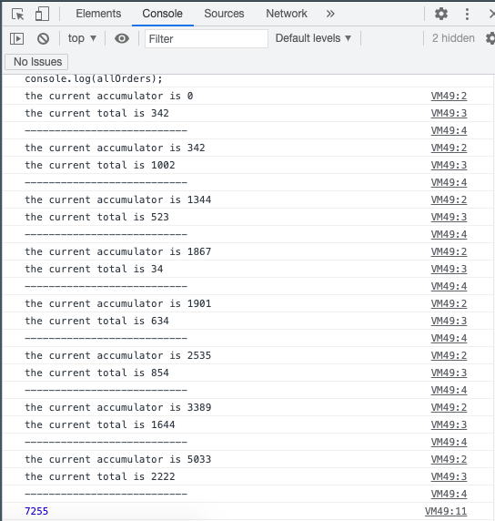

<a name="LogicAndFlowControl"></a>

# **Module #8 - Data types**

---

<a name="forEach"></a>

## **ARRAY FOR EACH**

is useful for things called side effects.
Side effects is when you are inside of a function and you reach outside of that function to do something else, meaning when you need to loop with some data and do something with each piece of data, like login the value, attaching a event listener for a click, displaying the data on the page, etc.

Having an array:

```js
const toppings = [
  "mushrooms",
  "tomatoes",
  "eggs",
  "chili",
  "lettuce",
  "avocado",
  "chiles",
  "pickles",
  "onions",
  "cheese",
];
```

we can loop by doing:

```js
function logToppings(topping) {
  console.log(topping);
}

toppings.forEach(logTopping);
```

or with an arrow function:

```js
toppings.forEach((topping) => {
  console.log(topping);
});
```

we can do more with `forEach`

```js
function logToppings(topping, index, array) {
  //Log the topping
  console.log(topping);

  //Log the prev topping
  const prevTopping = array[index - 1];
  prevTopping ? console.log(prevTopping) : null;

  //log the next topping
  const nextTopping = array[index + 1];
  nextTopping ? console.log(nextTopping) : null;

  //if its the last item in the array say good bye
  index === array.length - 1 ? console.log('good bye') : console.log('Getting the next topping');
  console.log(-------🍕-------);
}

toppings.forEach(logTopping);
```

<br>

<a name="mapping"></a>

## **MAP**

Map, filter and reduce are useful when you need to take data, do something with that data and return that data that has been modified, massaged or transformed in some way.

Map is like a machine in a factory, it takes in data, perform an operation and spits it out on the other side.

> Map will always produce the same length of the array as it starts with.

Map works with strings, numbers, objects etc...

some examples:

```js
const names = ['wes', 'kait', 'puppy'];

const orderTotals = [342, 1002, 523, 34, 634, 854, 1644, 2222];

const people = [
  {
    birthday: 'April 22, 1993',
    names {
      first: 'Keith',
      last: 'Buckley',
    }
  }
  {
    birthday: 'January 3, 1975',
    names {
      first: 'Larry',
      last: 'Heep',
    }
  }
  {
    birthday: 'February 12, 1944',
    names {
      first: 'Linda',
      last: 'Bermeer',
    }
  }
]
```

now we will work with map to do some modifications

1. **names array:** Add the word 'Bos' as last name for each name, and put the first letter of each name in capitals
2. **orderTotals array:** add taxes to each amount.
3. **people array:** figure it out how old they are and return their full name and birthday in an object

```js
// point # 1
function capitalize(word) {
  return `${word[0].toUpperCase()}${word.slice(1)}`;
}
function bosify(name) {
  return `${name} Bos`;
}

const fullNames = names.map(capitalize).map(bosify);
console.log(fullNames);

//point # 2
const orderTotalsWithTax = orderTotals.map((total) => total * 1.13);
console.log(orderTotalsWithTax);

//point # 3
const cleanPeople = people.map(function (person) {
  //get their birthday, getTime will convert into milliseconds javascript format
  const birthday = new Date(person.birthday).getTime();

  //how old they are
  const now = Date.now();
  const age = math.floor((now - birthday) / 31536000000);

  //return their full name and birthday in an object
  return {
    age,
    name: `${person.names.first} ${person.names.last}`,
  };
});
console.table(cleanPeople);
```

> to work with timestamps (milliseconds or dates) you can go to [Epoch converter](https://epoch.vercel.app)

> If you want to work with dates you must visit [Date functions](https://date-fns.org)

<br>

<a name="filterFindHigherOrderFunctions"></a>

## **FILTER, FIND AND HIGHER ORDER FUNCTIONS**

- **Filter**  
  Filter will loop into all the items and return all of the items that matches with what you want.
  lets filter the array persons to get the older than 40 years

  ```js
  const over40 = cleanPeople.filter((person) => person.age > 40);

  console.table(over40);
  ```

- **Find**  
  Filter will only find one item in the array and return it.

  Having the array of student:

  ```js
  const students = [
    {
      id: "11ce",
      first_name: "Dall",
      last_name: "Puckring",
    },
    {
      id: "2958",
      first_name: "Margarete",
      last_name: "Brandi",
    },
    {
      id: "565a",
      first_name: "Bendicty",
      last_name: "Woodage",
    },
    {
      id: "3a16",
      first_name: "Micki",
      last_name: "Mattes",
    },
  ];
  ```

  lets find by ID:

  ```js
  const student = students.find((stud) => stud.id === "565a");

  console.log(student);
  ```

  > Find returns the object instead Filter returns the array

- **Higher order functions**  
  Function inside another function is what is called higher other function.
  With higher order functions we can also go further and write a function to find by properties (id, first name, last name, etc)

  ```js
  function findByProp(prop, propWeAreLookingFor) {
    return function isStudent(student) {
      return student[prop] === propWeAreLookingFor;
    };
  }
  const student = students.find(findByProp(id, "565a"));
  const student2 = students.find(findByProp(first_name, "Micki"));

  console.log(student);
  console.log(student2);
  ```

<br>

<a name="reduce"></a>

## **REDUCE**

Reduce does so much and there are a handful of different cases for it.  
Reduce it takes in an array of data and it will return a result or a single value.

lets add all of these up:

```js
const orderTotals = [342, 1002, 523, 34, 634, 854, 1644, 2222];
```

```js
function tallyNumbers(accumulator, currentTotal) {
  console.log(`the current accumulator is ${accumulator}`);
  console.log(`the current total is ${currentTotal}`);
  console.log("---------------------------");
  //return the accumulator plus the amount of the order
  return accumulator + currentTotal;
}

const allOrders = orderTotals.reduce(tallyNumbers, 0);

console.log(allOrders);
```

the result is:



next example with an inventory:

```js
const inventory = [
  { type: "shirt", price: 4000 },
  { type: "pants", price: 4532 },
  { type: "socks", price: 243 },
  { type: "shirt", price: 2343 },
  { type: "pants", price: 2343 },
  { type: "socks", price: 542 },
  { type: "pants", price: 123 },
];
```

First thing is check howe many of each items are there, and total value of all the inventory.

```js
function inventoryReducer(counter, item) {
  console.log(`looping over ${item.type}`);

  //check if the item exist in or create and increment the type by 1
  counter[item.type] = counter[item.type] + 1 || 1;

  //return the total, so the next loop can use it
  return counter;
}

const inventoryCounts = inventory.reduce(inventoryReducer, {});

console.log(inventoryCounts);

//price
const totalInventoryPrice = inventory.reduce(
  (acc, item) => acc + item.price,
  0
);

console.log(totalInventoryPrice);
```

<br>

<a name="reduceExercise"></a>

## **REDUCE EXERCISE**

We will count the characters in the page [MDN reduce](https://developer.mozilla.org/en-US/docs/Web/JavaScript/Reference/Global_Objects/Array/Reduce).

First we need to convert all the text into an array, then we need to filter the spaces, comas, parenthesis etc.  
After that we need to convert the text into lowercase, and start counting.

> complete exercise [here](https://codepen.io/cgope/pen/JjWYBMp)

<br>

<a name="forForInForOfWhileLoops"></a>

## **FOR, FOR IN, FOR OF, WHILE LOOPS**

- ### **For**

  syntax:  
  for ([initialExpression]; [condition]; [incrementExpression]){  
   statement;  
  }

  ```js
  for (let i = 0; i <= 10; i++) {
    console.log(i);
  }
  ```

  This code will start at 0 and increment by 1 until it gets to 10.  
  For loop is helpful to loop over something like array of numbers.

  ```js
  const numbers = [2, 34, 3, 23, 42, 3, 1, 65, 364, 5, 645, 6];

  //this will give us the length of the array which is 12 (12 items)
  for (i = 0; i < numbers.length; number++) {
    console.log(i);
  }

  //to access on each item in the array:
  for (i = 0; i < numbers.length; numbers++) {
    console.log(numbers[i]);
  }
  ```

  Using the last one we will access to the index on each position

- ### **For in**

  Use for loop over keys of an object

  ```js
  const wes = {
    name: "wes",
    age: 10,
    cool: "true",
  };

  for (const prop in wes) {
    console.log(prop);
  }
  ```

- ### **For of**

  Useful looping over iterables, iterables is something that has a length (numbers, string, etc), promises and can handle emojis.

  ```js
  const name = "Cesar Gomez";

  for (const letter of name) {
    console.log(letter);
  }

  //can be done with numbers as well, doesn't give us the index just the raw value
  const numbers = [2, 34, 3, 23, 42, 3, 1, 65, 364, 5, 645, 6];

  for (number of numbers) {
    console.log(number);
  }
  ```

- ### **While loop**

  While loop will take a condition and run infinitely until the condition is false.

  ```js
  let cool = 'true;
  while(cool === true){
    console.log('you are cool');
  }
  ```

  this example can crash tabs since we don't have an exit condition, so it will run infinitely, we can add an exit condition

  ```js
  let cool = true;
  let i = 1;

  while (cool === true) {
    console.log("you are cool");
    i++;
    if (i > 10) {
      cool = false;
    }
  }
  ```

- ### **Do while loop**

  Thew only difference between while and do while, is that in the second the do will run first and then check the condition after the first run

  ```js
  let cool = true;
  let i = 1;

  do {
    console.log("you are cool");
    i++;
  } while (i < 10);
  {
    cool = false;
  }
  ```

<br>

---

back to [Table of Content](tableOfContent.md)  
previous [Data Types](08_DataTypes.md)  
next [Harder Practice Exercises](09_GettingLoopy.md)
