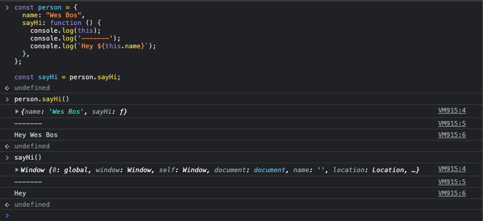

<a name="Prototypes"></a>

# **Module #11 - Prototypes, 'this', 'new', and inheritance**

---

<a name="TheNewKeyword"></a>

## **THE NEW KEYWORD**

Using the NEW keyword in Javascript, will create a new object that is an instance of whatever function you have made it from

```js
  const myDate = new Date('August 11, 2025);

  console.log(myDate);
```

myDate is an instance of Date

```js
typeof myDate;
// object

myDate instanceof Date;
// true
```

functions:


<br>

<a name="TheThisKeyword"></a>

## **THE THIS KEYWORD**

The this keyword in Javascript refers to the instance of an object that a function is bound

> the this keyword is equals the thing to the left of the dot when you're calling a method.

```js
function Pizza(toppings = [], customer) {
  console.log("making a pizza");
  //save the toppings that were passed in, to this instance of Pizza
  this.toppings = toppings;
  this.customer = customer;
  this.id = Math.floor(Math.random() * 16777215).toString(16);
}

const pepperoniPizza = new Pizza(["pepperoni"], "Wes Bos");
const canadianPizza = new Pizza(
  ["pepperoni", "mushrooms", "onion"],
  "Kait Bos"
);
```

Heres the result:


<br>

<a name="PrototypeRefactorOfTheGalleryExercise"></a>

## **PROTOTYPE REFACTOR OF THE GALLERY EXERCISE**

Example [here](https://codepen.io/cgope/pen/NWjNBBR)

<br>

<a name="PrototypesAndPrototypalInheritance"></a>

## **PROTOTYPES AND PROTOTYPAL INHERITANCE**

If we have a function and we use the **NEW** keyword, it will return an object that is an instance of that object:

```js
function Pizza(toppings = [], customer) {
  console.log("making a pizza");
  //save the toppings that were passed in, to this instance of Pizza
  this.toppings = toppings;
  this.customer = customer;
  this.id = Math.floor(Math.random() * 16777215).toString(16);
}

const pepperoniPizza = new Pizza(["pepperoni"], "Wes Bos");
const canadianPizza = new Pizza(
  ["pepperoni", "mushrooms", "onion"],
  "Kait Bos"
);
```

In this case Pepperoni pizza and Canadian pizza are instance of Pizza, and we can attach properties to that instance is by using the **THIS** keyword, so each pizza will have her own properties.

lets count the number of slices on each pizza by adding a slices property:

```js
function Pizza(toppings = [], customer) {
  console.log("making a pizza");
  this.toppings = toppings;
  this.customer = customer;
  this.id = Math.floor(Math.random() * 16777215).toString(16);

  //adding slices property to each pizza
  this.slices = 10;
}
```

If we want to track how many pizzas are left, we can use a prototype, since every pizza have to had his own toppings, customer, id and slices but the functionality to eat a pizza is the same for every single pizza.
so instead of put a function on every single instance to prevent the memory uses in the computers, we can put it on the prototype.

```js
Pizza.prototype.eat = function () {
  if (this.slices > 0) {
    this.slices = this.slices - 1;
    console.log(`you have ${this.slices} left`);
  } else {
    console.log(`Sorry!, there's no slices left`);
  }
};
```

so we can use the eat function on every single pizza we want to create:


<br>

<a name="PrototypeRefactorOfTheSliderExercise"></a>

## **PROTOTYPE REFACTOR OF THE SLIDER EXERCISE**

Example [here](https://codepen.io/cgope/pen/dyWXEpp)

<br>
<a name="BindCallAndApply"></a>

## **BIND, CALL AND APPLY**

- ### BIND

  Bind, call and apply, are three function that are used to change the scope of what this is equal to inside of a function or inside of a method.

  > Bind, call and apply will change the scope of the 'THIS' keyword inside of a function or method.

  ```js
  const person = {
    name: "Wes Bos",
    sayHi: function () {
      return `Hey ${this.name}`;
    },
  };

  person.sayHi();
  // the output is: hey Wes Bos
  ```

  The 'THIS' keyword is referring to what is at the left of the function, in this case the function is **sayHi()** and what is in the left of the dot is **person**

  but if we have the method sayHi() in his own variable, the 'THIS' keyword will change.

  

  when we use the `person.sayHi()` the 'THIS' keyword is referring to the object, in this case Wes Bos, but when we use the `sayHi()` the 'THIS' keyword is referring to the Window.

  > In Javascript 'THIS' keyword is always defined by where the function is being called, and not where is the function being defined

  we can use the **Bind** to change where 'THIS' keyword is defined, this will change what the 'THIS' keyword is equal or what it's bound too.

  this is useful if we want to use a method from an object with some other information, like use the method **sayHi** to another object:

  

- ### CALL AND APPLY

  Have the same use than bind with some differences:

  - Call and Apply will call the function, instead of returning a function they will call the function
  - Apply accept a single array of arguments

  

<br>

---

back to [Table of Content](tableOfContent.md)  
previous [Harder practice exercises](10_HarderPracticeExercises.md)  
next [Advanced flow control](12_AdvanceFlowControl.md)
