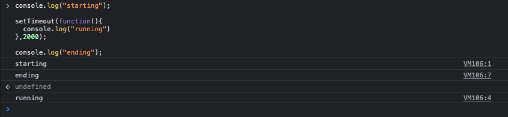
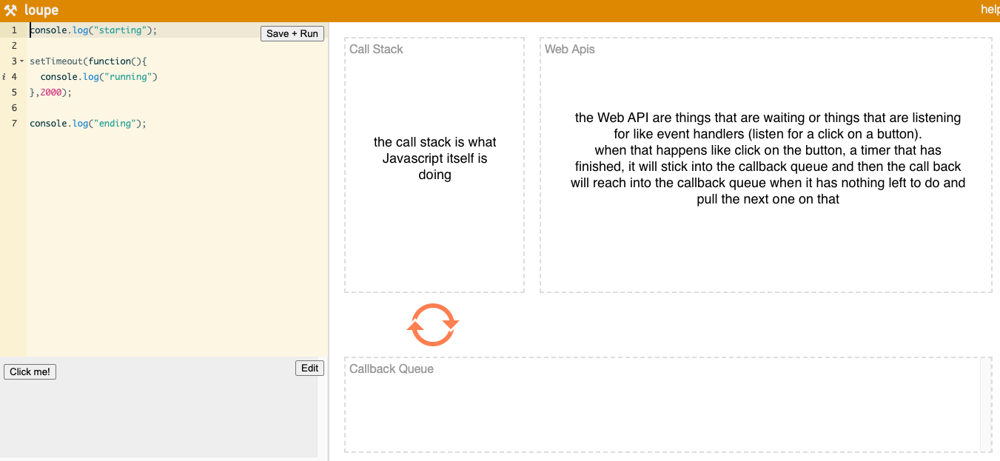

<a name="AdvancedFlowControl"></a>

# **Module #12 - Advanced flow control**

---

<a name="TheEventLoopAndCallbackHell"></a>

## **THE EVENT LOOP AND CALLBACK HELL**

Javascript is a single threaded language, that means that only one thing can only be run at a time.
Some other languages are multi thread, that means that they can run multiple process at once

> Javascript can only ever run one thing at once

```JS
console.log("starting");

setTimeout(function(){
  console.log("running")
},2000);

console.log("ending");
```

the output expected should be:

- starting
- running
- ending

but doesn't work that way, the way that Javascript works is that it will parse the first line

- `console.log("starting");`, then parse the next line
- `setTimeout(function(){ console.log("running") },2000);`  
  (setTimeout function) so it will "pin" in that and come back in 2 seconds, then go ahead and runs the next line
- `console.log("ending");` then 2 seconds later come back to the callback function that's been queued up

so based on that the result is:

- starting
- ending
- running



Javascript is asynchronous that means is not going to stop running the `setTimeout` function, its going to put this in what we call "the Web API" and then when thats has come back after 2 seconds its going to stick in the callback queue, then when the call stack has a free second when its not currently running anything, its going to reach into the call stack queue run the call back for us



there's a page called [loupe from by Philip Roberts](http://latentflip.com/loupe/?code=JC5vbignYnV0dG9uJywgJ2NsaWNrJywgZnVuY3Rpb24gb25DbGljaygpIHsKICAgIHNldFRpbWVvdXQoZnVuY3Rpb24gdGltZXIoKSB7CiAgICAgICAgY29uc29sZS5sb2coJ1lvdSBjbGlja2VkIHRoZSBidXR0b24hJyk7ICAgIAogICAgfSwgMjAwMCk7Cn0pOwoKY29uc29sZS5sb2coIkhpISIpOwoKc2V0VGltZW91dChmdW5jdGlvbiB0aW1lb3V0KCkgewogICAgY29uc29sZS5sb2coIkNsaWNrIHRoZSBidXR0b24hIik7Cn0sIDUwMDApOwoKY29uc29sZS5sb2coIldlbGNvbWUgdG8gbG91cGUuIik7!!!PGJ1dHRvbj5DbGljayBtZSE8L2J1dHRvbj4%3D) that can explain that pretty good

The **CALLBACK HELL** also named as christmas tree code.
if you need to do one thing after another, you must nest the callbacks inside of each other because they all depend on the previous callback to being called before it can then go ahead and run.  
Example:
if you have a text and what to do somethings on on that text

Things to do:

1. change the text to go when clicked
2. make it a circle after 2 seconds
3. make it red after 0.5 seconds
4. make it square after 0.25 seconds
5. make it purple after 0.3 seconds
6. fade out after 0.5 seconds

it will look like this:

```JS
go.addEventListener("click", function(event){
  const element = event.currentTarget;
  element.textContent = 'GO!';
    setTimeout(function(){
      element.classList.add("circle");
        setTimeout(function (){
        element.classList.add("red");
            setTimeout(function(){
            element.classList.remove("circle");
                setTimeout(function(){
                element.classList.remove("red");
                element.classList.add("purple");
                    setTimeout(function(){
                    element.classList.add("fade");
                    },500)
                },300)
            },250)
        },500);
    },2000);
})
```

> CodePen example [here](https://codepen.io/cgope/details/bGrYPrQ)

the solution to that is the promise land

<br>
<a name="Promises"></a>

## **PROMISES**

Promises is the idea of IOU (i owe you) for something that will happen in the future.  
The promise take a callback function, and that callback function takes 2 arguments:

- resolve function
- reject function
  then when its ready, you can resolve the promise, and when it fails the promise will be reject

in order to create a new promise we have to use the "new" keyword:

```JS
function makePizza(toppings){
  return new Promise(function(resolve, reject){
    const amountOfTimeToBake = 500 + (toppings.length * 200)
    // wait for the pizza to cook
    setTimeout(function(){
      // when you are ready, you can resolve this promise
      resolve(`Heres your pizza with the toppings ${toppings.join (' ')}`);
    }, amountOfTimeToBake)
  });
}
```

now in other to access to the resolve value of the pizza is with `then()` that receive a callback function and you can chain how many `then()` as its needed.

```JS
makePizza(['peperoni'])
  .then(function(pizza){
  console.log(pizza);
  return makePizza(['ham', 'cheese'])
  })
  .then(function(pizza){
  console.log(pizza);
  return makePizza(['hot pepper', 'onion', 'feta'])
  })
  .then(function(pizza){
  console.log(pizza);
  return makePizza(['peperoni', 'mushrooms', 'onion'])
  })
  .then(function(pizza){
  console.log('All done, heres yor last pizza');
  console.log(pizza);
  })
```

we can use `Promise.all` if you want to know when all promises are done

```JS
function makePizza(toppings){
  return new Promise(function(resolve, reject){
    const amountOfTimeToBake = 500 + (toppings.length * 200)
    // wait for the pizza to cook
    setTimeout(function(){
      // when you are ready, you can resolve this promise
      resolve(`Heres your pizza with the toppings ${toppings.join (' ')}`);
    }, amountOfTimeToBake)
  });
}

// run them concurrently
const pizzaPromise1 = makePizza(['ham', 'cheese']);
const pizzaPromise2 = makePizza(['hot pepper', 'onion', 'feta']);
const pizzaPromise3 = makePizza(['peperoni', 'mushrooms', 'onion']);

const dinnerPromise = Promise.all([pizzaPromise1, pizzaPromise2, pizzaPromise3]);

dinnerPromise.then(function(['hamAndCheese', 'hottie', 'canadian']){
  console.log(hamAndCheese, hottie, canadian)
})
```

if you want to know the first promise that gets resolve you can use `Promise.race()`

```JS
function makePizza(toppings){
  return new Promise(function(resolve, reject){
    const amountOfTimeToBake = 500 + (toppings.length * 200)
    // wait for the pizza to cook
    setTimeout(function(){
      // when you are ready, you can resolve this promise
      resolve(`Heres your pizza with the toppings ${toppings.join (' ')}`);
    }, amountOfTimeToBake)
  });
}

// run them concurrently
const pizzaPromise1 = makePizza(['ham', 'cheese']);
const pizzaPromise2 = makePizza(['hot pepper', 'onion', 'feta']);
const pizzaPromise3 = makePizza(['peperoni', 'mushrooms', 'onion']);

const firstPizzaPromise = Promise.race([pizzaPromise1, pizzaPromise2, pizzaPromise3]);

firstPizzaPromise.then( pizza => {
  console.log('the first pizza, its done!');
  console.log(pizza);
})
```

<br>
<a name="PromisesErrorHandling"></a>

## **PROMISES ERROR HANDLING**

The way that you handle errors is with `catch()` at the end.

```JS
function makePizza(toppings){
  return new Promise(function(resolve, reject){
    // reject if ppl try with pineapple
    if(toppings.includes('pineapple')){
      reject('Sorry =[, you can not order pizza with pineapple')
    }
    const amountOfTimeToBake = 500 + (toppings.length * 200)
    setTimeout(function(){
      resolve(`Heres your pizza with the toppings ${toppings.join (' ')}`);
    }, amountOfTimeToBake)
  });
}

makePizza(['cheese', 'pineapple'])
.then(pizza => {
  console.log(pizza);
}).catch(error => {
  console.log(error);
})
```

we can handle errors in a function:

```JS
function handleError(error){
  console.log(error)
}

makePizza(['ham', 'cheese'])
.then(pizza => {
console.log(pizza);
return makePizza(['pineapple', 'cheese'])
})
.then(pizza => {
console.log(pizza);
return makePizza(['peperoni', 'mushrooms', 'onion'])
}).catch(handleError)
```

in this case we can not have the last pizza because the previous one have pineapple, in order to fix that we can use `Promise.allSettled()`

```JS
function makePizza(toppings){
  return new Promise(function(resolve, reject){
    // reject if ppl try with pineapple
    if(toppings.includes('pineapple')){
      reject('Sorry =[, you can not order pizza with pineapple')
    }
    const amountOfTimeToBake = 500 + (toppings.length * 200)
    setTimeout(function(){
      resolve(`Heres your pizza with the toppings ${toppings.join (' ')}`);
    }, amountOfTimeToBake)
  });
}
// all settled
const pizzaPromise1 = makePizza(['ham', 'cheese']);
const pizzaPromise2 = makePizza(['pineapple', 'cheese']);
const pizzaPromise3 = makePizza(['peperoni', 'mushrooms', 'onion']);

const dinnerPromise = Promise.allSettled([pizzaPromise1, pizzaPromise2, pizzaPromise3]).catch(handleError);

dinnerPromise.then( results => {
  console.log('your results!');
  console.log(results);
})
```

<br>
<a name="EventLoopCallbackHellRefactor"></a>

## **REFACTORING THE EVENT LOOP AND CALLBACK HELL EXERCISE TO PROMISE LAND**

the exercise is in CodePen:

> the CodePen example is [here](https://codepen.io/cgope/pen/ExvoeaZ)

<br>

```JS
// function wait in millisecond
const wait = (ms = 0) => new Promise(resolve => setTimeout(resolve, ms));

const go = document.querySelector('.go');

function animate(event){
  const element = event.currentTarget;

  // 1. change the text to go when clicked
  element.textContent = 'GO!';
  wait(2000)
  .then(()=>{
    // 2. make it a circle after 2 seconds
    element.classList.add("circle");
    return wait(500);
  })
  .then(()=>{
    // 3. make it red after 0.5 seconds
    element.classList.add("red");
    return wait(250);
  })
  .then(()=>{
    // 4. make it square after 0.25 seconds
    element.classList.remove("circle");
    return wait(300)
  })
  .then(()=>{
    // 5. make it purple after 0.3 seconds
    element.classList.remove("red");
    element.classList.add("purple");
    return wait(500)
  })
  .then(()=>{
    // 6. fade out after 0.5 seconds
    element.classList.add("fade");
  })
  .catch(error => {
    console.log(error);
  })
}

go.addEventListener('click', animate);
```

<br>
<a name="AsyncAwait"></a>

## **ASYNC AWAIT**

Async-Await is a new syntax that will allow us to use the keyword **async** and the keyword **await** for a much nicer/easier to read looking code

if we want to display une message and after 2 seconds other message, like

```JS
// timer function
function wait (ms = 0){
  new Promise(resolve =>{
    setTimeout(resolve, ms)
  })
}
// display message
function go(){
  console.log('starting');
  wait(2000);
  console.log('ending')
}
```

it will not work due to the wait function will go to the callback queue, we can use async-await to solve that:

```JS
// timer function
function wait (ms = 0){
  new Promise(resolve =>{
    setTimeout(resolve, ms)
  })
}
// display message
async function go(){
  console.log('starting');
  await wait(2000);
  console.log('ending')
}
```

this will run the first message `starting` and after 2 seconds will display the second message `ending`

we can use async in every type of function and objects

```JS
// function declaration
async function fd (){

}

// arrow functions
const arrowFd = async ()=>{

}

// call back
window.addEventListener('click', async function(){

})

// object
const person{
  sayHi: async function(){

  },
  // method shorthand for object
  async sayHi(){

  },
  // function property
  sayHi: async () => {

  }
}

```

Refactoring the event loop callback hell to async

> CodePen example [here](https://codepen.io/cgope/pen/QWMaVxy);

```JS
// function wait in milisecond
const wait = (ms = 0) => new Promise(resolve => setTimeout(resolve, ms));

const go = document.querySelector('.go');

async function animate(event){
  const element = event.currentTarget;

    // 1. change the text to go when clicked
    element.textContent = 'GO!';
    await wait(2000);
    // 2. make it a circle after 2 seconds
    element.classList.add("circle");
    await wait(500);
   // 3. make it red after 0.5 seconds
    element.classList.add("red");
    await wait(250);
   // 4. make it square after 0.25 seconds
    element.classList.remove("circle");
    await wait(300);
    // 5. make it purple after 0.3 seconds
    element.classList.remove("red");
    element.classList.add("purple");
    await wait(500);
    // 6. fade out after 0.5 seconds
    element.classList.add("fade");
}

go.addEventListener('click', animate);
```

<br>
<a name="AsyncAwaitErrorHandling"></a>

## **ASYNC AWAIT ERROR HANDLING**

There are 4 ways to handle error, the first two are with `try` and `catch`, anything foes wrong inside the **try** it won't break the application it will just fail over the **catch** portion

we have a function to make pizza:

```JS
function makePizza(toppings){
  return new Promise(function(resolve, reject){
    // reject if ppl try with pineapple
    if(toppings.includes('pineapple')){
      reject('Sorry =[, you can not order pizza with pineapple')
    }
    const amountOfTimeToBake = 500 + (toppings.length * 200)
    setTimeout(function(){
      resolve(`Heres your pizza with the toppings ${toppings.join (' ')}`);
    }, amountOfTimeToBake)
  });
}
```

- lets see how try and catch works:

  ```JS
  async function go(){
    try{
      const pizza = await makePizza(['pineapple']);
      console.log(pizza);
    }catch(error){
      console.log(error);
    }
  }
  ```

- try catch promise handling:

  ```JS
  function handleError(error){
  console.log(error);
  }

  async function go(){
    const pizza = await makePizza(['pineapple']).catch(handleError);
    console.log(pizza);
  }
  ```

  or you can use catch when you call the function:

  ```JS
  function handleError(error){
  console.log(error);
  }

  async function go(){
    const pizza = await makePizza(['pineapple']);
    console.log(pizza);
  }

  go().catch(handleError);
  ```

- higher order functions:

  ```JS
  function handleError(error){
  console.log(error);
  }

  //make a safe function with higher order functions
  function makeSafe(fn, errorHandler){
    return function (){
      fn().catch(errorHandler)
    }
  }

  const safeGo = makeSafe(go, handleError);

  safeGo();
  ```

<br>
<a name="AsyncAwaitPromptUI"></a>

## **ASYNC AWAIT PROMPT UI**

> CodePen example [here](https://codepen.io/cgope/pen/KKvZbzw)

<br>
<a name="AsyncAwaitTypeUI"></a>

## **ASYNC AWAIT TYPE UI**

- way one - for of loop

  > CodePen example [here](https://codepen.io/cgope/pen/GRvQJxo)

- way one - recursion
  > CodePen example [here](https://codepen.io/cgope/pen/qBXxdGW)

<br>

---

back to [Table of Content](tableOfContent.md)  
previous [Advanced flow control](11_Prototype.md)  
next [Ajax and fetching data](13_AjaxAndFetchingData.md)
