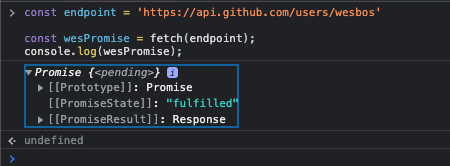
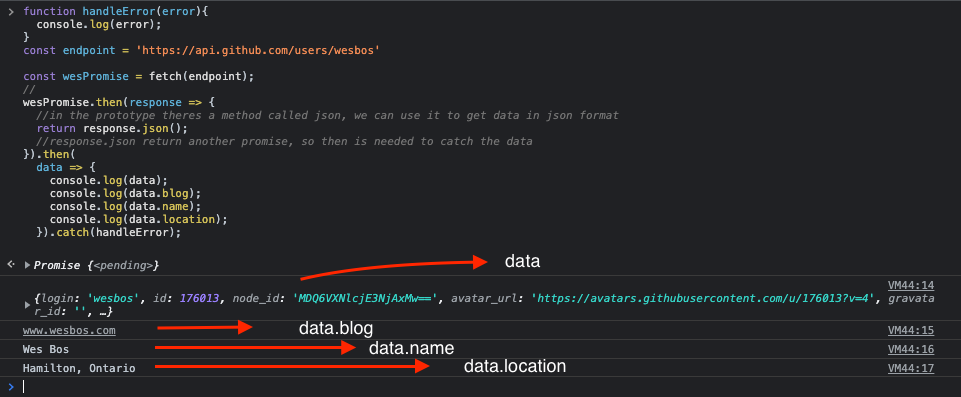

<a name="AjaxAndFetchingData"></a>

# **Module #13 - Ajax and fetching data**

<br>
<a name="AjaxAndAPI"></a>

## **AJAX AND API**

The oder use for async-await and promises is fetching data from what's called an API (Application program interface).

> API in other words is some way that you can talk to a machine in a somewhat of standardized procedure.

AJAX stands for: Asynchronous Javascript and XML.
XML is another way to receive data, but now is replaced by JSON (Javascript Object Notation).

in order to get data from an API we need the **endpoint** which is the URL, for instance GitHub: https://api.github.com/users/wesbos

so we will do something like:

```JS
const endpoint = 'https://api.github.com/users/wesbos'
```

then we need to call `fetch()` API and pass the endpoint, that will return a promise:

```JS
const endpoint = 'https://api.github.com/users/wesbos'

const wesPromise = fetch(endpoint);
console.log(wesPromise);
```

  
this come back with the data, but if you wanna get that data back into javascript, you can use `then()`

```JS
// handle error function
function handleError(error){
  console.log(error);
}
const endpoint = 'https://api.github.com/users/wesbos'

const wesPromise = fetch(endpoint);
//
wesPromise.then(response => {
  //in the prototype theres a method called json, we can use it to get data in json format
  return response.json();
  //response.json return another promise, so then is needed to catch the data
})
.then(
  data => {
    console.log(data);
    console.log(data.blog);
    console.log(data.name);
    console.log(data.location);
 })
 .catch(handleError);
```



its like double promise, se first one gets the response and the second one gets the response and turn into json for us.

> [here's](https://codepen.io/cgope/pen/JjypKRo) a CodePen with the exercise using async-await with fetch

<br>
<a name="CorsAndRecipes"></a>

## **CORS AND RECIPES**

CORS means Cross origin resource sharing.

Origin means websites:

wesbos (origin) <-- share data --> github (origin)

by default you're not allow to share data between origins, meaning that websites cannot talk to each other from one domain to another domain name.

if you want to get data from github, that page needs to implement something called CORS policy (this happens on the server)

> in that case github has to say something like "wesbos.com is allowed to ask for data and we will return it, that is safe"

> [here](https://codepen.io/cgope/pen/oNeEWGO) a CodePen exercise

<br>
<a name="dadJokes"></a>

## **DAD JOKES**

> CodePen example [here](https://codepen.io/cgope/pen/VwzQNgB)

<br>
<a name="CurrencyConverter"></a>

## **CURRENCY CONVERTER**

> CodePen example [here](https://codepen.io/cgope/pen/ZEJxGGe)

<br>

---

back to [Table of Content](tableOfContent.md)  
previous [Advanced flow control](11_Prototype.md)  
next [Ajax and fetching data](14_ESModulesAndStructuringLargerApps.md)
