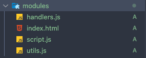
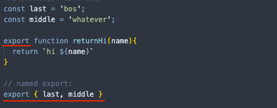
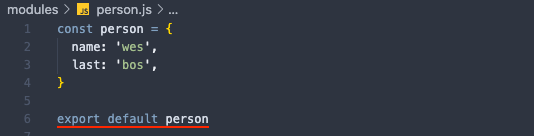
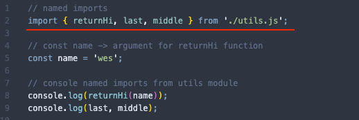
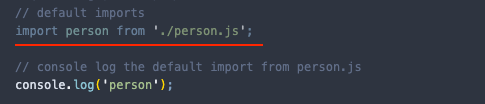
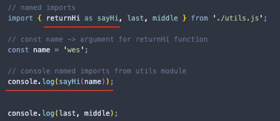

<a name="14_ESModulesAndStructuringLargerApps"></a>

# **Module #14 - ES Modules and structuring Larger Apps**

<br>
<a name="Modules"></a>

## **Modules**

Modules are a way to structure and organize Javascript to share functionality and data across multiple files and/or projects.

Characteristics:

- Modules have their own scope, we don't need to worry about global variables.
  > NOTE: variables that you create inside a module it will be available only in that file, nowhere else
- Modules can hold anything (functionality, data, config, etc).

Supposing that we have the following structure:



we can load each javascript file in the body like:

```HTML
<body>
  <script src="./utils.js"></script>
  <script src="./handlers.js"></script>
  <script src="./script.js"></script>
</body>
```

but instead of doing that, we can use modules and use the script.js as our entry point and share data, functionality etc with modules by adding the attribute type and set to module:

```HTML
<body>
  <script src="./script.js" type="module"></script>
</body>
```

if we need to use a function that is our `utils.js` we can imported into our `script.js`

there are two types to export files

- **named exports:** they have the `export` word in front of the variable declaration/function definition or when they exported there will be curly brackets.  
  You can have as many named exports as you want.

  

- **default exports:** you can have only one per module, you can exports default as follow

  

there are two types to export files

- **named imports:** you need to use the word `import` then in curly brackets the named exports and the path when you want to import, in this case `util.js`

  

- **default imports:**

  

you can rename the import as you wanted, for example the `returnHi` function to `sayHi`



### **Documentation:**

[modules](https://developer.mozilla.org/en-US/docs/Web/JavaScript/Guide/Modules)  
[imports](https://developer.mozilla.org/en-US/docs/Web/JavaScript/Reference/Statements/import)  
[exports](https://developer.mozilla.org/en-US/docs/Web/JavaScript/Reference/Statements/export)

<br>

---

back to [Table of Content](tableOfContent.md)  
previous [Ajax and fetching data](13_AjaxAndFetchingData)  
next [Final round exercises](15_FinalRoundExercises.md)
